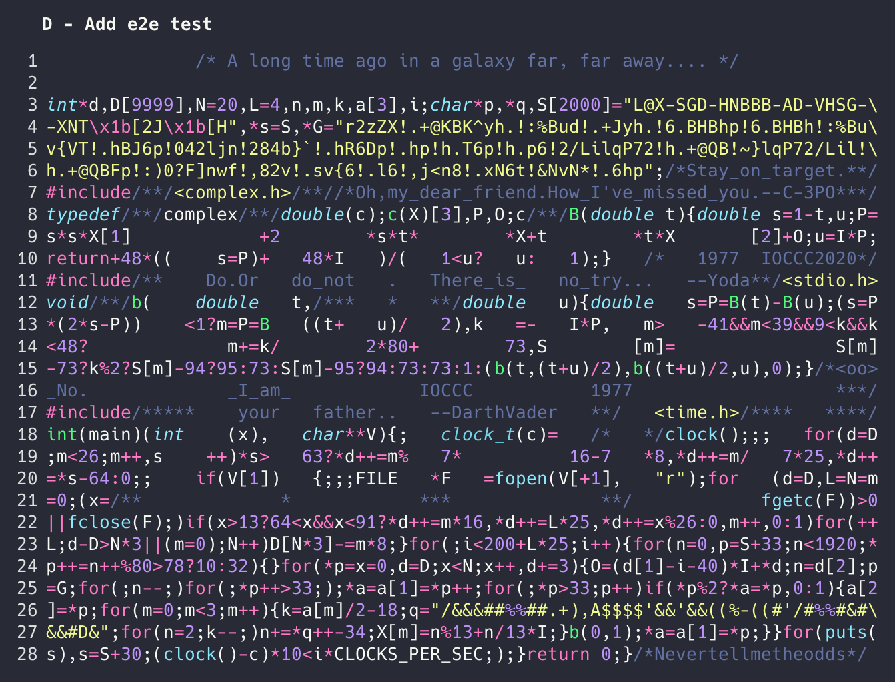

# Mend
[](https://github.com/craftvscruft/mend/blob/main/LICENSE)

> Scripted disciplined refactoring for legacy code

## What is this?
Working in "mends" means breaking down large remodeling into tiny auditable steps. 

* A **Mend** is a series of **Steps** starting from a known state
* A **Step** is an invocation of exactly one known **Recipe**
* A **Recipe** is an executable script taking zero or more arguments
* A **Run** leaves a trail of source code changes with one **Step** per commit, with tests run after each

These tiny steps can often increase the effectiveness of humans working on legacy code.
Moreover, this may currently be the _only_ reliable way for Large Language Models
([LLMs](https://learnprompting.org/docs/basics/intro))
to edit code.

### What can recipes do?

Recipes are just scripts, they can do anything that can be reliably automated. For many languages, this includes 
formatting, lint auto-fixes, renames, extract, move, and others.

Most of this functionality has historically been coupled to IDEs. However, there are a few good 
command line tools available - such as clang-rename for C/C++, Eclim for Java, good old-fashioned sed - and we should build more of them!

The sister project [Untangler](https://github.com/craftvscruft/untangler) is an effort to build the first multi-language automation-friendly refactoring CLI.

## Status

Beta testing, looking for [feedback](https://github.com/craftvscruft/mend/issues/1).

## Example

Here we run `mend` on Yusuke Endoh's 2020 [IOCCC winner](https://www.ioccc.org/2020/endoh2/index.html)
using the steps in [examples/mend.toml](examples/mend.toml).




## Requirements

* Building: 
  * [Rust](https://www.rust-lang.org/) (tested with 1.71.1)
* Running
  * git
  * sh on path (usually bound to bash or zsh)

## Running

```
cargo run -- -f mend.toml
```
More info on creating mend.toml coming soon, in the meantime checkout [examples/mend.toml](examples/mend.toml).


## Testing

```
cargo test
```

If the approval test results have changed, review them with:
```
cargo insta review
```

## Author

👤 **Ray Myers**

* YouTube: [Craft vs Cruft](https://www.youtube.com/channel/UC4nEbAo5xFsOZDk2v0RIGHA)
* Twitter: [@lambdapocalypse](https://twitter.com/lambdapocalypse)
* GitHub: [@raymyers](https://github.com/raymyers)
* LinkedIn: [@cadrlife](https://linkedin.com/in/cadrlife)

## Inspiration

* Martin Fowler's [Refactoring](https://refactoring.com) book and catalog
* Kent Beck's [TCR](https://medium.com/p/870bbd756864) == Test && Commit || Revert
* Marianne Bellotti's [Kill It With Fire](https://nostarch.com/kill-it-fire)
* [Arlo Belshee's Commit Notation](https://github.com/RefactoringCombos/ArlosCommitNotation)
* [IOCCC](https://www.ioccc.org) - International Obfuscated C Code Contest


## 📝 License

Copyright © 2023 [Ray Myers](https://github.com/raymyers).

This project is [Apache 2](https://www.apache.org/licenses/LICENSE-2.0) licensed.
